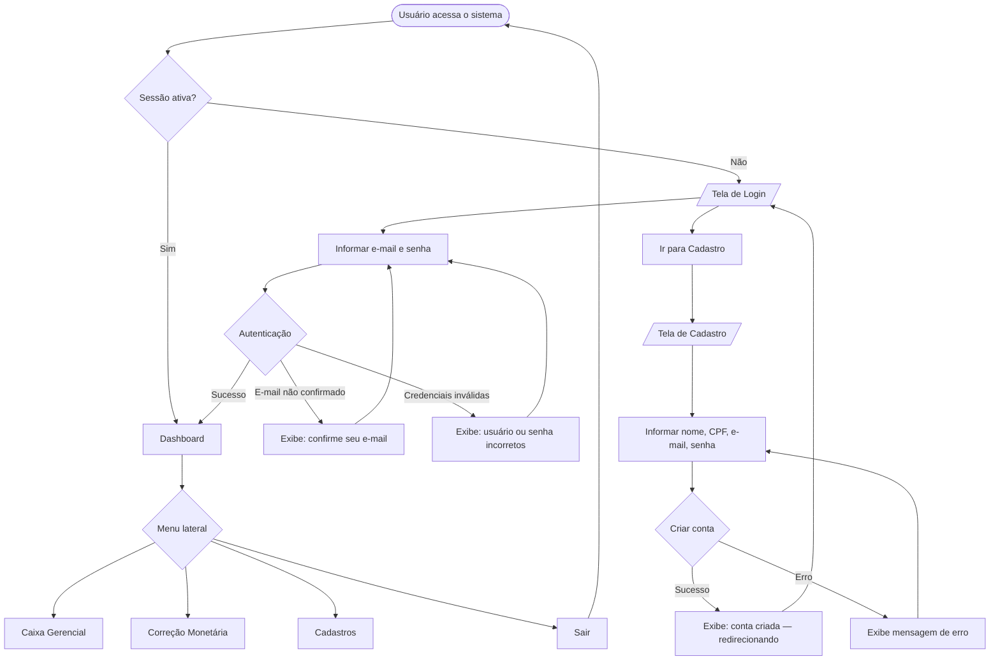
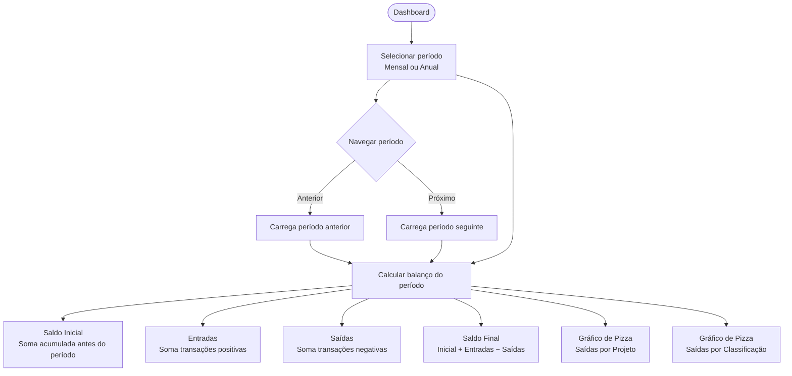
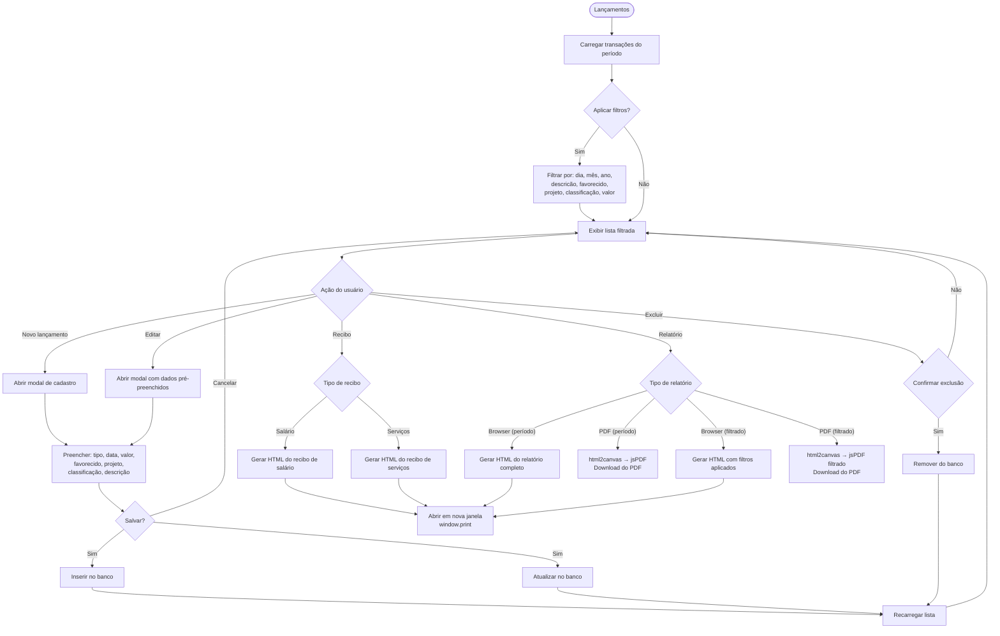
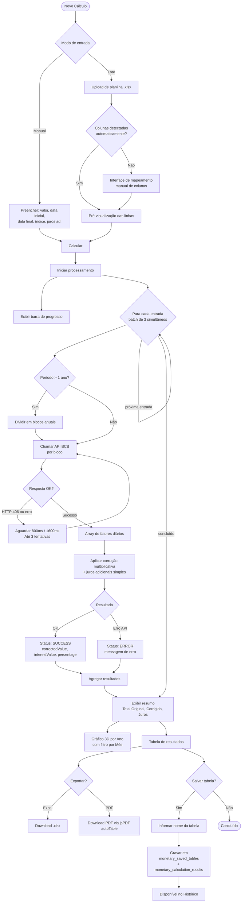
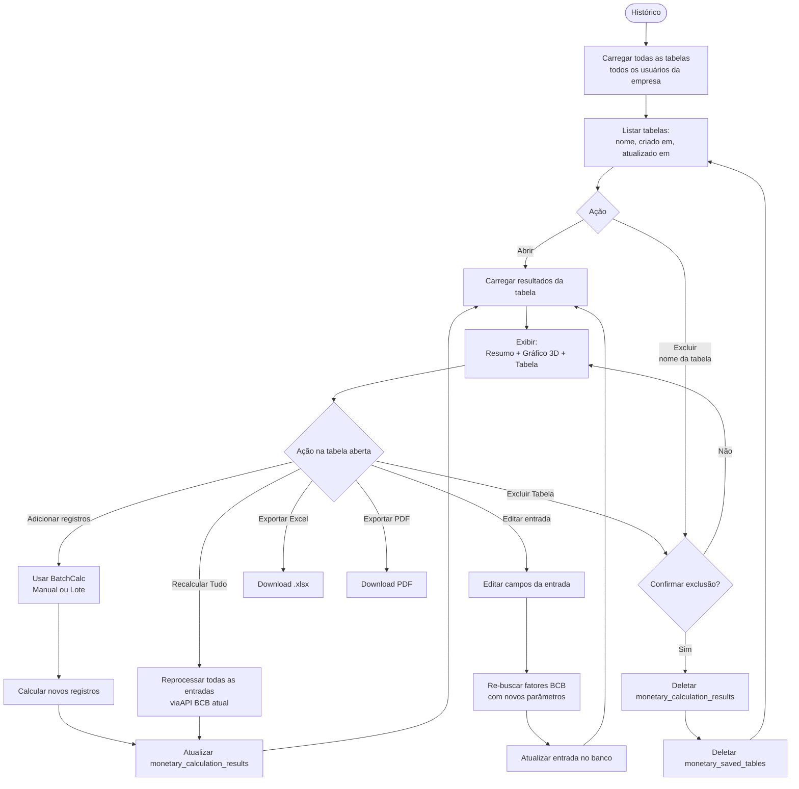
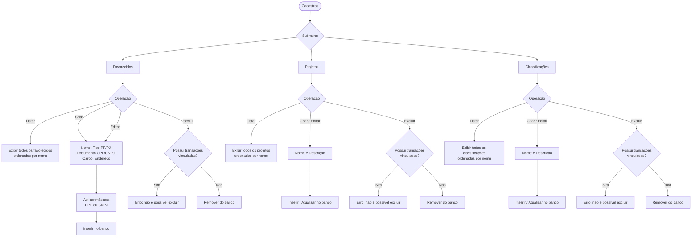
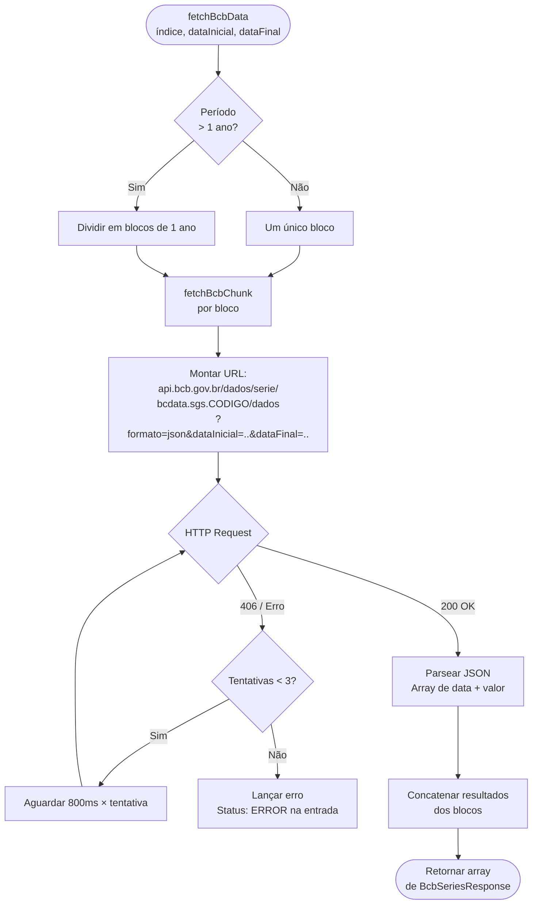
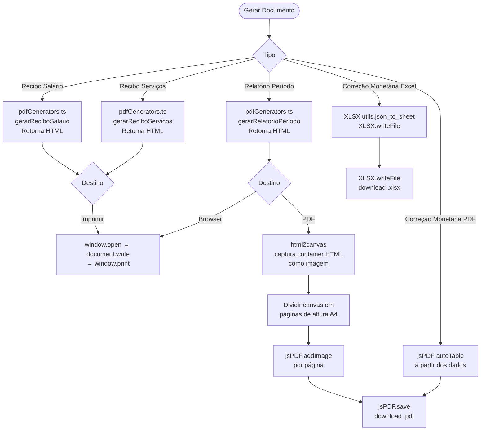
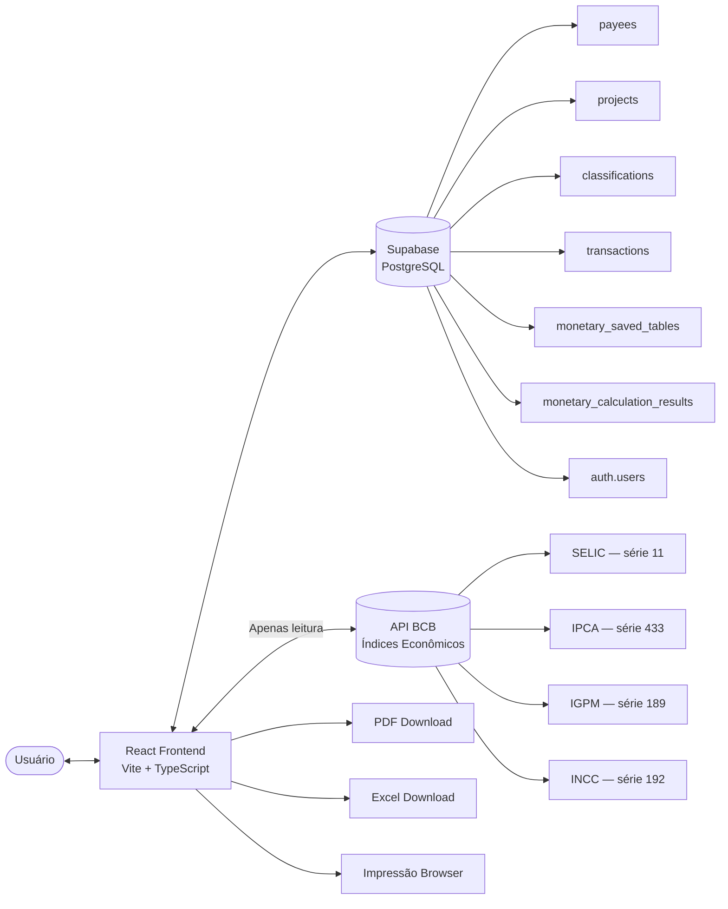

# Mapa de Fluxo do Sistema — Caixa Gerencial

---

## 1. Fluxo Geral de Acesso

---

## 2. Módulo: Caixa Gerencial — Dashboard

---

## 3. Módulo: Caixa Gerencial — Lançamentos

---

## 4. Módulo: Correção Monetária — Novo Cálculo

---

## 5. Módulo: Correção Monetária — Histórico

---

## 6. Módulo: Cadastros

---

## 7. Fluxo de Integração com a API BCB

---

## 8. Fluxo de Geração de Documentos

---

## 9. Fluxo de Dados — Visão Geral

